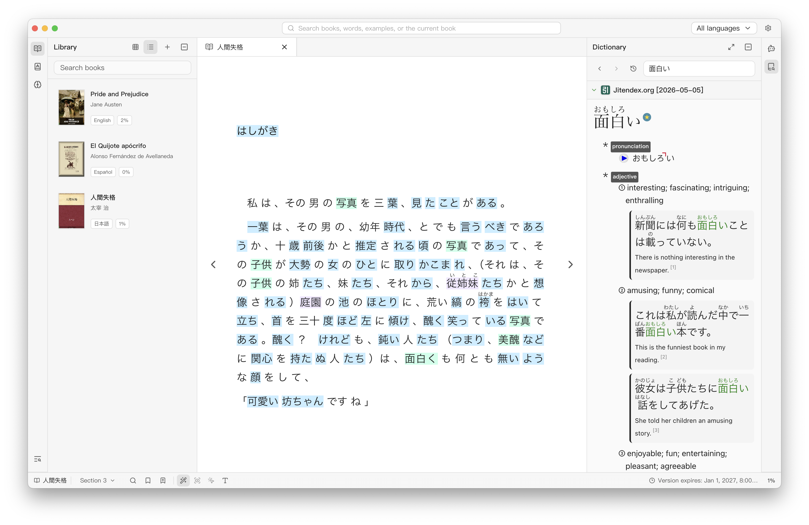
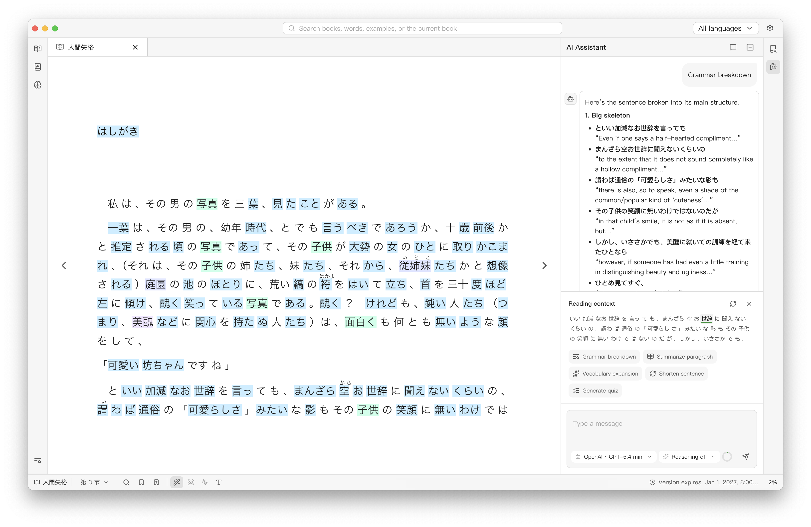
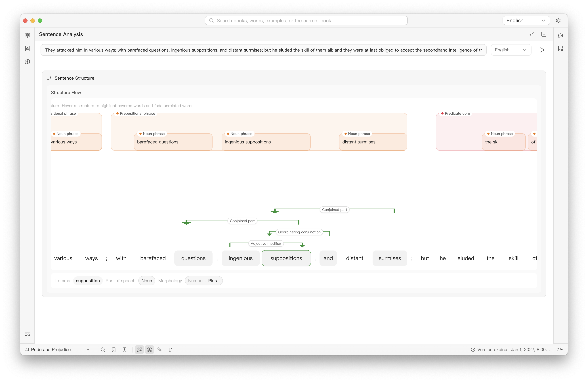
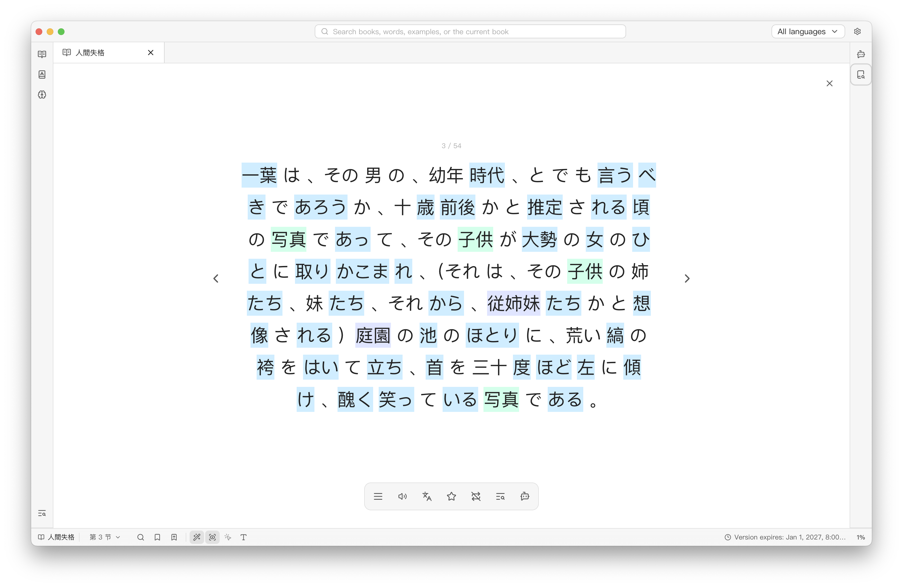
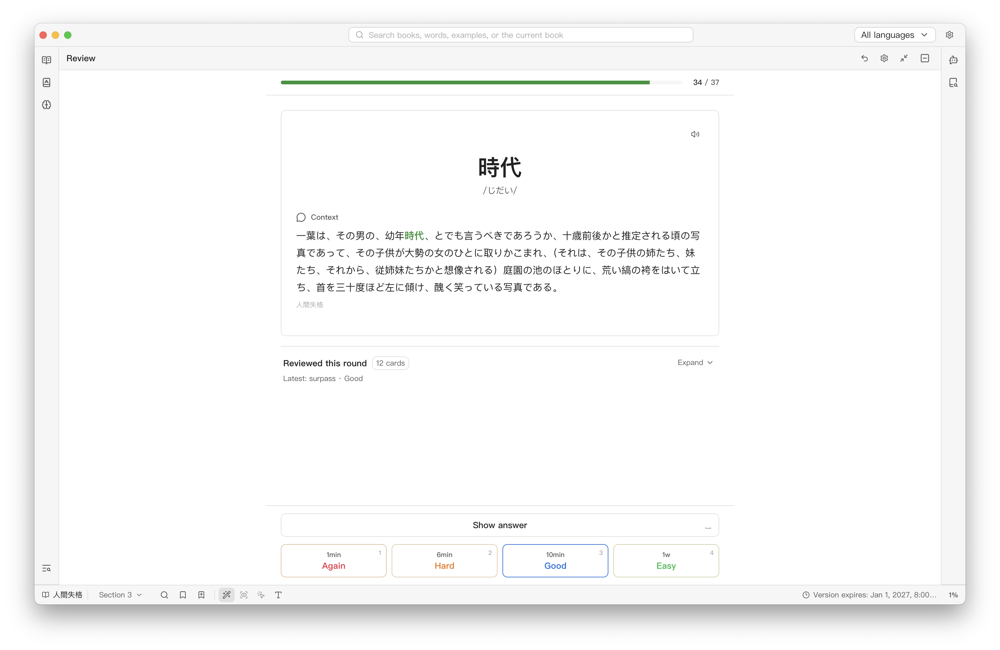
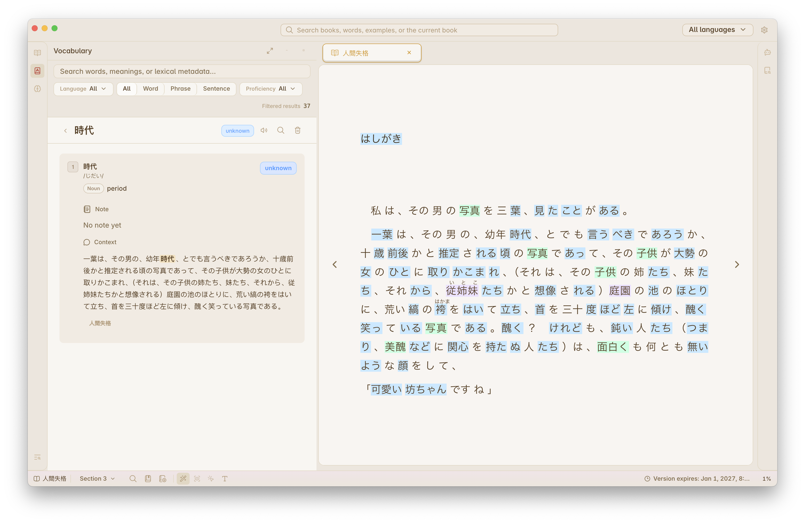

# Runer

Runer is a desktop reader for language learners. Read books and text files, look up words, analyze sentences, build vocabulary, and review what you learn without leaving the page.

## Features

- Read EPUB, MOBI, FB2, AZW3, TXT, HTML, and Markdown files
- Multilingual language learning, with current support for English, Japanese, and Spanish
- Look up and translate selected text with local MDict and StarDict dictionaries
- Focus on one sentence at a time with Single Sentence Mode
- Analyze sentence structure, word forms, and named entities with spaCy
- Connect your own AI provider and API key (BYOK) for chat, definitions, and quick sentence analysis
- Review word senses, phrases, and sentences with FSRS scheduling
- Use custom themes, including Obsidian themes, and personalize proficiency-based word highlights
- Add bookmarks and highlights

## Screenshots

### AI Assistant

### Sentence Analysis

### Single Sentence Mode

### Sense-level FSRS Review

### Custom Themes

This screenshot uses the [Primary](https://github.com/primary-theme/obsidian) Obsidian theme.

## Download

Download Runer from [GitHub Releases](https://github.com/RunerApp/runer-releases/releases) and choose the installer for your system.

## Feedback

Found a bug? [Open an issue](https://github.com/RunerApp/runer-releases/issues) and include your operating system, Runer version, and steps to reproduce it.
